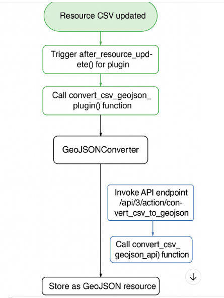

1. Estructura de carpetas

	ckanext-csvgeojson/
	│
	├── docs/
	│   └── flowchart.png      # Diagrama PNG
	│
	├── ckanext/
	│   └── csvgeojson/
	│       ├── plugin.py
	│       └── services/
	│           └── geojson_converter.py
	│
	└── README.md

2. Contenido de README.md

# CKANEXT-CSVGEOJSON

Extensión para **CKAN** que convierte recursos **CSV** en **GeoJSON** automáticamente y mediante un endpoint manual, almacenando el resultado en el storage nativo de CKAN.

---

## Características

- Conversión automática en `after_resource_update`.
- Conversión manual vía API (`/api/3/action/convert_csv_to_geojson`).
- Detección de columnas de coordenadas (`Lat`, `Lon`, `Latitud`, `Longitud`, etc.).
- Creación/actualización de recurso GeoJSON vinculado al dataset original.
- Copia manual del `.geojson` al storage de CKAN (`/var/lib/ckan/default/resources`).
- Compatible con vistas `ckanext-geoview`.

---

## Diagrama de flujo

---

## Endpoint manual

**URL:**
POST /api/3/action/convert_csv_to_geojson

**Headers:**
Content-Type: application/json
Authorization: <API_KEY>

css

**Body:**
json
{
  "resource_id": "6ef7d6bc-e5d5-46ab-97d4-5321c93dd49f"
}
Respuesta:

json

{
  "success": true,
  "message": "GeoJSON generado/actualizado para recurso 6ef7d6bc-e5d5-46ab-97d4-5321c93dd49f"
}

Instalación

Activar el Entorno virtual de ckan

. /usr/lib/ckan/default/bin/activate

Clonar el repositorio en el entorno CKAN:

cd /usr/lib/ckan/default/src
git clone https://github.com/jumargo73/ckanext-csvgeojson.git

Instalar Plugin:

sudo /usr/lib/ckan/default/bin/pip install -e /usr/lib/ckan/default/src/ckanext-csvgeojson
sudo cp -r /usr/lib/ckan/default/src/ckanext-csvgeojson/ckanext/csvgeojson/ /usr/lib/ckan/default/src/ckan/ckanext/

Instalar Extensiones si la Pide
sudo /usr/lib/ckan/default/bin/pip install -r /usr/lib/ckan/default/src/ckanext-csvgeojson/requirements.txt

Activar el plugin en ckan.ini:

ini
ckan.plugins = ... csv_to_geojson_api,csv_to_geojson_dataset_resource

Reiniciar CKAN:

sudo service supervisor restart
sudo service nginx restart

Ejemplo curl

curl -X POST "http://www.datosabiertos.valledelcauca.gov.co/api/3/action/convert_csv_to_geojson" \
     -H "Authorization: TU_API_KEY" \
     -H "Content-Type: application/json" \
     -d '{"resource_id": "6ef7d6bc-e5d5-46ab-97d4-5321c93dd49f"}'

Si se necesita desistalarlo 
sudo /usr/lib/ckan/default/bin/pip uninstall ckanext-csvgeojson -y

# Arquitectura del Módulo Sello Excelencia

Este módulo está dividido en **dos clases principales** con responsabilidades separadas:

+---------------------+ 
| SelloExcelenciaView |
| (Blueprint & UI)    |
+---------------------+ 
| - get_blueprint()   |
|  - Rutas / Templates| 
|  - /sello/listar    | 
|  - /resource_form   | 
|  - app_context_proc |
|  - inject_sello_    |
|  - extras()          |
+---------------------+ 

+-----------------------------+
| CSVtoGeoJSONDatasetResource |
| Even(tos CKAN) 				   |
+-----------------------------+
| - before_create(pkg/res)    |
| - after_create(pkg/res)     |
| - before_update(pkg/res)    |
| - after_update(pkg/res)     |
+-----------------------------+

+-----------------------------+
| ApiODataPluginView          |
| (Blueprint & UI)   		   |
+-----------------------------+
| get_blueprint()               |
| - proxy_datastore           |
|                             |
+-----------------------------+

+-----------------------------+
| ApiZipShpToGeojsonView      |
| (Blueprint & UI)   		   |
+-----------------------------+
| get_blueprint()             |
|  - shp_to_geojson           | 
   - convert_shp_geojson      |
      - convert_job           |
|                             |
+-----------------------------+

+-----------------------------+
| FixDateFormatPlugin         |
| Even(tos CKAN) 				   |
+-----------------------------+
| - before_create(pkg/res)    |
| - after_create(pkg/res)     |
| - before_update(pkg/res)    |
| - after_update(pkg/res)     |
+-----------------------------+

### Descripción de la interacción

1. **SelloExcelenciaView**
   - Maneja todas las **rutas y vistas** del módulo de Sellos.
   - `@app_context_processor` inyecta variables para los templates.
   - `update_config()` permite configurar CKAN al iniciar el plugin.
   - `get_blueprint()` Listamiento de los Endpoint del Modulo

2. **ApiODataPluginView**
   - Maneja todas las **rutas y vistas** del módulo de Sellos.
   - `@app_context_processor` inyecta variables para los templates.
   - `update_config()` permite configurar CKAN al iniciar el plugin.

3. **ApiZipShpToGeojsonView**
   - Maneja todas las **rutas y vistas** del módulo de Sellos.
   - `@app_context_processor` inyecta variables para los templates.
   - `update_config()` permite configurar CKAN al iniciar el plugin.   

4. **FixDateFormatPlugin**
   - Maneja **eventos de CKAN** sobre recursos (`IResourceController`).
   - Se encarga de **agregar, validar o eliminar el formato de datos en las vistas”** cuando el recurso edita.

5. **Flujo de datos**
   - El usuario interactúa con las **vistas** definidas en `SelloExcelenciaView`,`ApiODataPluginView`,`ApiZipShpToGeojsonView`.
   - Cuando se crea o edita un dataset o recurso, CKAN dispara los **hooks de eventos**, que son capturados por `CSVtoGeoJSONDatasetResourcePlugin` y `FixDateFormatPlugin`.
   - Los templates pueden acceder a variables globales inyectadas desde `inject_sello_extras()`.

---

✅ Este esquema muestra claramente la **separación de responsabilidades**:
- Una clase solo maneja la UI y rutas.  
- Otra clase solo maneja la lógica de eventos de CKAN.

Troubleshooting
GeoJSONConverter.detectar_columnas_coord() missing 1 required positional argument
→ Usar GeoJSONConverter.detectar_columnas_coord(columnas) correctamente.

LazyJSONObject en records
→ Convertir con records = list(data.get('records', [])).

FileNotFoundError al descargar
→ Asegurar copia manual en /var/lib/ckan/default/resources/<3>/<3>/<resto>.

Error 400 en endpoint
→ Revisar formato JSON y API Key en la petición.
